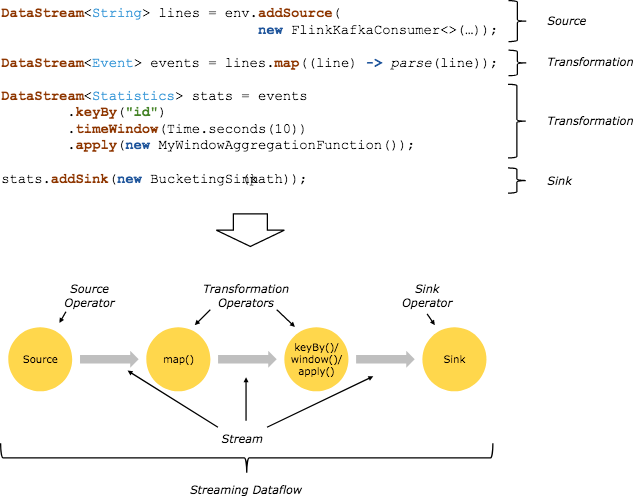
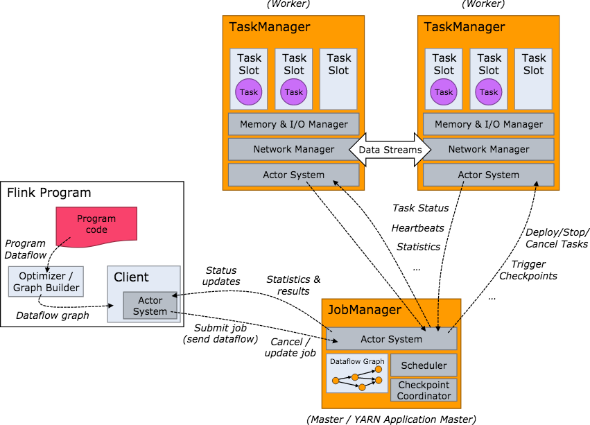
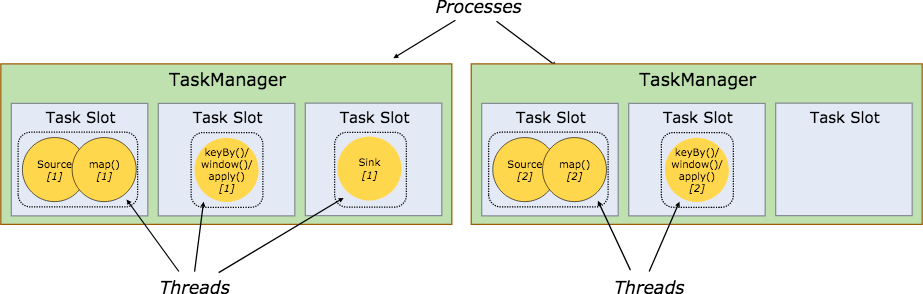
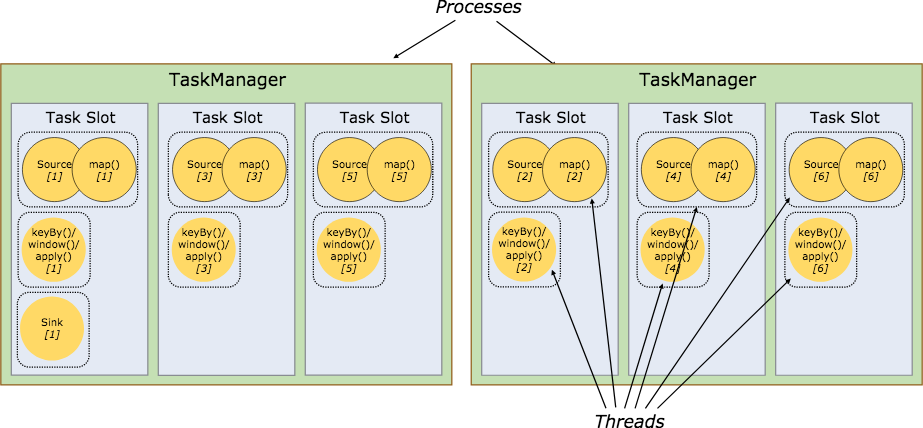
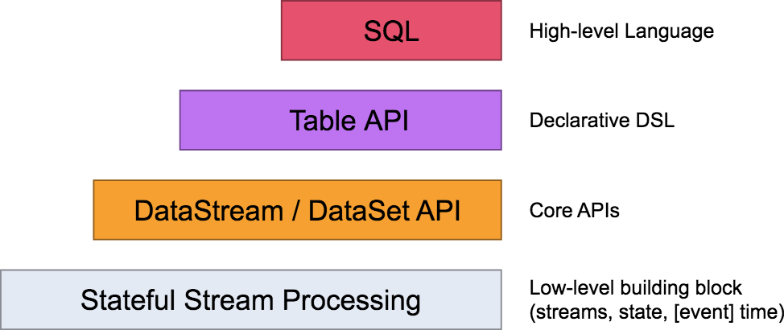
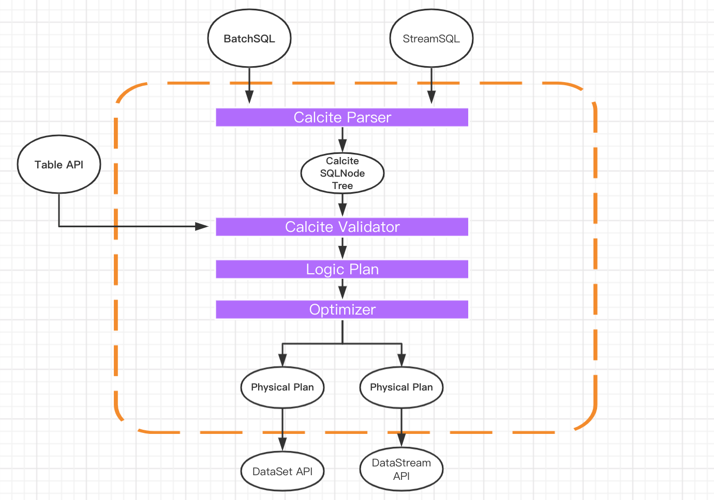
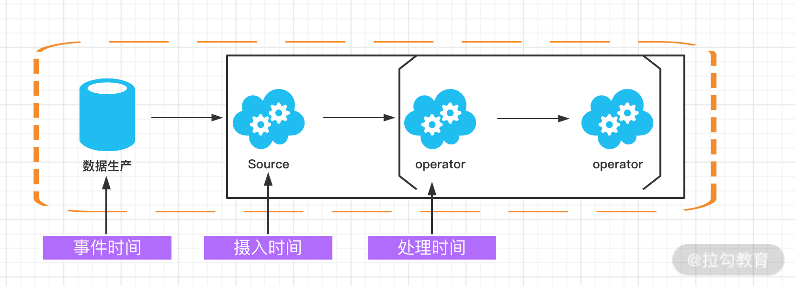
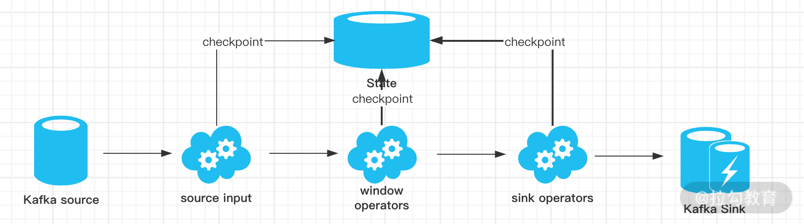

# Getting Started

### Reference Documentation

For further reference, please consider the following sections:

* [Official Apache Maven documentation](https://maven.apache.org/guides/index.html)
* [Spring Boot Maven Plugin Reference Guide](https://docs.spring.io/spring-boot/docs/2.6.3/maven-plugin/reference/html/)
* [Create an OCI image](https://docs.spring.io/spring-boot/docs/2.6.3/maven-plugin/reference/html/#build-image)
* [Spring Web](https://docs.spring.io/spring-boot/docs/2.6.3/reference/htmlsingle/#boot-features-developing-web-applications)
* [Spring Boot DevTools](https://docs.spring.io/spring-boot/docs/2.6.3/reference/htmlsingle/#using-boot-devtools)

### Guides

The following guides illustrate how to use some features concretely:

* [Building a RESTful Web Service](https://spring.io/guides/gs/rest-service/)
* [Serving Web Content with Spring MVC](https://spring.io/guides/gs/serving-web-content/)
* [Building REST services with Spring](https://spring.io/guides/tutorials/bookmarks/)

Flink SQL 是 Flink 实时计算为简化计算模型，降低用户使用实时计算门槛而设计的一套符合标准 SQL 语义的开发语言。

一个完整的 Flink SQL 编写的程序包括如下三部分。

Source Operator：是对外部数据源的抽象, 目前 Apache Flink 内置了很多常用的数据源实现，比如 MySQL、Kafka 等。
Transformation Operators：算子操作主要完成比如查询、聚合操作等，目前 Flink SQL 支持了 Union、Join、Projection、Difference、Intersection 及 window 等大多数传统数据库支持的操作。
Sink Operator：是对外结果表的抽象，目前 Apache Flink 也内置了很多常用的结果表的抽象，比如 Kafka Sink 等。

## Flink 核心概念
Streams（流），流分为有界流和无界流。有界流指的是有固定大小，不随时间增加而增长的数据，比如我们保存在 Hive 中的一个表；而无界流指的是数据随着时间增加而增长，计算状态持续进行，比如我们消费 Kafka 中的消息，消息持续不断，那么计算也会持续进行不会结束。
State（状态），所谓的状态指的是在进行流式计算过程中的信息。一般用作容错恢复和持久化，流式计算在本质上是增量计算，也就是说需要不断地查询过去的状态。状态在 Flink 中有十分重要的作用，例如为了确保 Exactly-once 语义需要将数据写到状态中；此外，状态的持久化存储也是集群出现 Fail-over 的情况下自动重启的前提条件。
Time（时间），Flink 支持了 Event time、Ingestion time、Processing time 等多种时间语义，时间是我们在进行 Flink 程序开发时判断业务状态是否滞后和延迟的重要依据。
API：Flink 自身提供了不同级别的抽象来支持我们开发流式或者批量处理程序，由上而下可分为 SQL / Table API、DataStream API、ProcessFunction 三层，开发者可以根据需要选择不同层级的 API 进行开发。

##  Flink 编程模型和流式处理
Flink 程序的基础构建模块是流（Streams）和转换（Transformations），每一个数据流起始于一个或多个 Source，并终止于一个或多个 Sink。数据流类似于有向无环图（DAG）。

在分布式运行环境中，Flink 提出了算子链的概念，Flink 将多个算子放在一个任务中，由同一个线程执行，减少线程之间的切换、消息的序列化/反序列化、数据在缓冲区的交换，减少延迟的同时提高整体的吞吐量。
在并行环境下，Flink 将多个 operator 的子任务链接在一起形成了一个task，每个 task 都有一个独立的线程执行。

Flink 集群模型和角色
在实际生产中，Flink 都是以集群在运行，在运行的过程中包含了两类进程。

JobManager：它扮演的是集群管理者的角色，负责调度任务、协调 checkpoints、协调故障恢复、收集 Job 的状态信息，并管理 Flink 集群中的从节点 TaskManager。
TaskManager：实际负责执行计算的 Worker，在其上执行 Flink Job 的一组 Task；TaskManager 还是所在节点的管理员，它负责把该节点上的服务器信息比如内存、磁盘、任务运行情况等向 JobManager 汇报。
Client：用户在提交编写好的 Flink 工程时，会先创建一个客户端再进行提交，这个客户端就是 Client，Client 会根据用户传入的参数选择使用 yarn per job 模式、stand-alone 模式还是 yarn-session 模式将 Flink 程序提交到集群。

Flink 资源和资源组
在 Flink 集群中，一个 TaskManger 就是一个 JVM 进程，并且会用独立的线程来执行 task，为了控制一个 TaskManger 能接受多少个 task，Flink 提出了 Task Slot 的概念。

我们可以简单的把 Task Slot 理解为 TaskManager 的计算资源子集。假如一个 TaskManager 拥有 5 个 slot，那么该 TaskManager 的计算资源会被平均分为 5 份，不同的 task 在不同的 slot 中执行，避免资源竞争。但是需要注意的是，slot 仅仅用来做内存的隔离，对 CPU 不起作用。那么运行在同一个 JVM 的 task 可以共享 TCP 连接，减少网络传输，在一定程度上提高了程序的运行效率，降低了资源消耗。

与此同时，Flink 还允许将不能形成算子链的两个操作，比如下图中的 flatmap 和 key&sink 放在一个 TaskSlot 里执行以达到资源共享的目的。

## Flink 的优势及与其他框架的区别

架构
Stom 的架构是经典的主从模式，并且强依赖 ZooKeeper；Spark Streaming 的架构是基于 Spark 的，它的本质是微批处理，每个 batch 都依赖 Driver，我们可以把 Spark Streaming 理解为时间维度上的 Spark DAG。

Flink 也采用了经典的主从模式，DataFlow Graph 与 Storm 形成的拓扑 Topology 结构类似，Flink 程序启动后，会根据用户的代码处理成 Stream Graph，然后优化成为 JobGraph，JobManager 会根据 JobGraph 生成 ExecutionGraph。ExecutionGraph 才是 Flink 真正能执行的数据结构，当很多个 ExecutionGraph 分布在集群中，就会形成一张网状的拓扑结构。

容错
Storm 在容错方面只支持了 Record 级别的 ACK-FAIL，发送出去的每一条消息，都可以确定是被成功处理或失败处理，因此 Storm 支持至少处理一次语义。

针对以前的 Spark Streaming 任务，我们可以配置对应的 checkpoint，也就是保存点。当任务出现 failover 的时候，会从 checkpoint 重新加载，使得数据不丢失。但是这个过程会导致原来的数据重复处理，不能做到“只处理一次”语义。

Flink 基于两阶段提交实现了精确的一次处理语义，我们将会在后面的课时中进行完整解析。

反压（BackPressure）
反压是分布式处理系统中经常遇到的问题，当消费者速度低于生产者的速度时，则需要消费者将信息反馈给生产者使得生产者的速度能和消费者的速度进行匹配。

Stom 在处理背压问题上简单粗暴，当下游消费者速度跟不上生产者的速度时会直接通知生产者，生产者停止生产数据，这种方式的缺点是不能实现逐级反压，且调优困难。设置的消费速率过小会导致集群吞吐量低下，速率过大会导致消费者 OOM。

Spark Streaming 为了实现反压这个功能，在原来的架构基础上构造了一个“速率控制器”，这个“速率控制器”会根据几个属性，如任务的结束时间、处理时长、处理消息的条数等计算一个速率。在实现控制数据的接收速率中用到了一个经典的算法，即“PID 算法”。

Flink 没有使用任何复杂的机制来解决反压问题，Flink 在数据传输过程中使用了分布式阻塞队列。我们知道在一个阻塞队列中，当队列满了以后发送者会被天然阻塞住，这种阻塞功能相当于给这个阻塞队列提供了反压的能力。

Map
Map 接受一个元素作为输入，并且根据开发者自定义的逻辑处理后输出。

FlatMap
FlatMap 接受一个元素，返回零到多个元素。FlatMap 和 Map 有些类似，但是当返回值是列表的时候，FlatMap 会将列表“平铺”，也就是以单个元素的形式进行输出。

Filter
顾名思义，Fliter 的意思就是过滤掉不需要的数据，每个元素都会被 filter 函数处理，如果 filter 函数返回 true 则保留，否则丢弃。

Aggregations
Aggregations 为聚合函数的总称，常见的聚合函数包括但不限于 sum、max、min 等。Aggregations 也需要指定一个 key 进行聚合

Reduce
Reduce 函数的原理是，会在每一个分组的 keyedStream 上生效，它会按照用户自定义的聚合逻辑进行分组聚合。

Table API 和 SQL 处于最顶端，是 Flink 提供的高级 API 操作。Flink SQL 是 Flink 实时计算为简化计算模型，降低用户使用实时计算门槛而设计的一套符合标准 SQL 语义的开发语言。

你之前可能都了解过 Hive，在离线计算场景下 Hive 几乎扛起了离线数据处理的半壁江山。它的底层对 SQL 的解析用到了 Apache Calcite，Flink 同样把 SQL 的解析、优化和执行教给了 Calcite。

下图是一张经典的 Flink Table & SQL 实现原理图，可以看到 Calcite 在整个架构中处于绝对核心地位。

动态表
与传统的表 SQL 查询相比，Flink Table & SQL 在处理流数据时会时时刻刻处于动态的数据变化中，所以便有了一个动态表的概念。

动态表的查询与静态表一样，但是，在查询动态表的时候，SQL 会做连续查询，不会终止。

WINDOW

根据窗口数据划分的不同，目前 Apache Flink 有如下 3 种：

滚动窗口，窗口数据有固定的大小，窗口中的数据不会叠加；

滑动窗口，窗口数据有固定大小，并且有生成间隔；

会话窗口，窗口数据没有固定的大小，根据用户传入的参数进行划分，窗口数据无叠加；

整体上讲，这四种级别的配置生效优先级如下：算子级别 > 执行环境级别 > 提交任务级别 > 系统配置级别。

Flink Side OutPut 分流
分流场景
我们在生产实践中经常会遇到这样的场景，需把输入源按照需要进行拆分，比如我期望把订单流按照金额大小进行拆分，或者把用户访问日志按

分流的方法
通常来说针对不同的场景，有以下三种办法进行流的拆分。

Filter 分流
Split 分流
但是要注意，使用 split 算子切分过的流，是不能进行二次切分的，假如把上述切分出来的 zeroStream 和 oneStream 流再次调用 split 切分，控制台会抛出以下异常。

SideOutPut 分流
SideOutPut 是 Flink 框架为我们提供的最新的也是最为推荐的分流方法，在使用 SideOutPut 时，需要按照以下步骤进行：

定义 OutputTag
调用特定函数进行数据拆分
ProcessFunction
KeyedProcessFunction
CoProcessFunction
KeyedCoProcessFunction
ProcessWindowFunction
ProcessAllWindowFunction

SideOutPut 方式拆分流是可以多次进行拆分

Complex Event Processing（CEP）是 Flink 提供的一个非常亮眼的功能，关于 CEP 的解释我们引用维基百科中的一段话：

CEP, is event processing that combines data from multiple sources to infer events or patterns that suggest more complicated circumstances. The goal of complex event processing is to identify meaningful events (such as opportunities or threats) and respond to them as quickly as possible.

在我们的实际生产中，随着数据的实时性要求越来越高，实时数据的量也在不断膨胀，在某些业务场景中需要根据连续的实时数据，发现其中有价值的那些事件。

程序结构
Flink CEP 的程序结构主要分为两个步骤：

定义模式
匹配结果

Flink 的“精确一次”处理语义是，Flink 提供了一个强大的语义保证，也就是说在任何情况下都能保证数据对应用产生的效果只有一次，不会多也不会少。

最多一次（At-most-Once）：这种语义理解起来很简单，用户的数据只会被处理一次，不管成功还是失败，不会重试也不会重发。

至少一次（At-least-Once）：这种语义下，系统会保证数据或事件至少被处理一次。如果中间发生错误或者丢失，那么会从源头重新发送一条然后进入处理系统，所以同一个事件或者消息会被处理多次。

精确一次（Exactly-Once）：表示每一条数据只会被精确地处理一次，不多也不少。

在这里我们解释一下“端到端（End to End）的精确一次”，它指的是 Flink 应用从 Source 端开始到 Sink 端结束，数据必须经过的起始点和结束点。Flink 自身是无法保证外部系统“精确一次”语义的，所以 Flink 若要实现所谓“端到端（End to End）的精确一次”的要求，那么外部系统必须支持“精确一次”语义；然后借助 Flink 提供的分布式快照和两阶段提交才能实现。

分布式快照机制
同 Spark 相比，Spark 仅仅是针对 Driver 的故障恢复 Checkpoint。而 Flink 的快照可以到算子级别，并且对全局数据也可以做快照。Flink 的分布式快照受到  Chandy-Lamport 分布式快照算法启发，同时进行了量身定做

Barrier
Flink 分布式快照的核心元素之一是 Barrier（数据栅栏），我们也可以把 Barrier 简单地理解成一个标记，该标记是严格有序的，并且随着数据流往下流动。每个 Barrier 都带有自己的 ID，Barrier 极其轻量，并不会干扰正常的数据处理。

问题，因为 Flink 运行在分布式环境中，一个 operator 的上游会有很多流，每个流的 barrier n 到达的时间不一致怎么办？这里 Flink 采取的措施是：快流等慢流。

异步和增量
由于 checkpoint 是一个全局状态，用户保存的状态可能非常大，多数达 G 或者 T 级别。在这种情况下，checkpoint 的创建会非常慢，而且执行时占用的资源也比较多，因此 Flink 提出了增量快照的概念。也就是说，每次都是进行的全量 checkpoint，是基于上次进行更新的。

两阶段提交

TwoPhaseCommitSinkFunction。两阶段搭配特定的 source 和 sink（特别是 0.11 版本 Kafka）使得“精确一次处理语义”成为可能。

在 Flink 中两阶段提交的实现方法被封装到了 TwoPhaseCommitSinkFunction 这个抽象类中，我们只需要实现其中的beginTransaction、preCommit、commit、abort 四个方法就可以实现“精确一次”的处理语义，实现的方式我们可以在官网中查到：

beginTransaction，在开启事务之前，我们在目标文件系统的临时目录中创建一个临时文件，后面在处理数据时将数据写入此文件；

preCommit，在预提交阶段，刷写（flush）文件，然后关闭文件，之后就不能写入到文件了，我们还将为属于下一个检查点的任何后续写入启动新事务；

commit，在提交阶段，我们将预提交的文件原子性移动到真正的目标目录中，请注意，这会增加输出数据可见性的延迟；
abort，在中止阶段，我们删除临时文件。

Flink-Kafka Exactly-once

如上图所示，我们用 Kafka-Flink-Kafka 这个案例来介绍一下实现“端到端精确一次”语义的过程，整个过程包括：

从 Kafka 读取数据

窗口聚合操作

将数据写回 Kafka

整个过程可以总结为下面四个阶段：

一旦 Flink 开始做 checkpoint 操作，那么就会进入 pre-commit 阶段，同时 Flink JobManager 会将检查点 Barrier 注入数据流中 ；

当所有的 barrier 在算子中成功进行一遍传递，并完成快照后，则 pre-commit 阶段完成；

等所有的算子完成“预提交”，就会发起一个“提交”动作，但是任何一个“预提交”失败都会导致 Flink 回滚到最近的 checkpoint；

pre-commit 完成，必须要确保 commit 也要成功，上图中的 Sink Operators 和 Kafka Sink 会共同来保证。

## 如何排查生产环境中的反压问题

反压问题处理
我们已经知道反压产生的原因和监控的方法，当线上任务出现反压时，需要如何处理呢？

主要通过以下几个方面进行定位和处理：

数据倾斜

GC

代码本身

数据倾斜
数据倾斜问题是我们生产环境中出现频率最多的影响任务运行的因素，可以在 Flink 的后台管理页面看到每个 Task 处理数据的大小。当数据倾斜出现时，通常是简单地使用类似 KeyBy 等分组聚合函数导致的，需要用户将热点 Key 进行预处理，降低或者消除热点 Key 的影响。

GC
垃圾回收问题也是造成反压的因素之一。不合理的设置 TaskManager 的垃圾回收参数会导致严重的 GC 问题，我们可以通过 -XX:+PrintGCDetails 参数查看 GC 的日志。

代码本身
开发者错误地使用 Flink 算子，没有深入了解算子的实现机制导致性能问题。我们可以通过查看运行机器节点的 CPU 和内存情况定位问题。